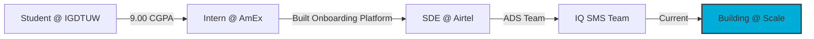

<div align="center">

# 👋 Hi, I'm Shreya

[](https://github.com/predator21x-bot)
[](https://linkedin.com/in/shreya24)
[](mailto:psbksshreya@gmail.com)

### Software Engineer @ Airtel Digital
**Building large-scale messaging platforms that handle billions of records**

</div>

---

## 🚀 What I Do

```golang
type SoftwareEngineer struct {
    Company       string
    Role          string
    CurrentFocus  []string
    Scale         string
}

shreya := SoftwareEngineer{
    Company:      "Airtel Digital",
    Role:         "Backend Engineer - Airtel IQ SMS",
    CurrentFocus: []string{"Distributed Systems", "High-Throughput APIs", "Microservices"},
    Scale:        "Billions of records • Millions of users",
}
```

💼 Building **customer-facing messaging platforms** at **Airtel IQ SMS**  
🎯 Architecting **distributed backend systems** with **Golang, Java & Apache Kafka**  
🚀 Solving problems at **massive scale** - billions of records, millions of users  
⚡ Passionate about **system design, scalability & performance optimization**

---

## 💻 Tech Arsenal

### Languages


### Backend & Distributed Systems


### Databases


### Monitoring & Observability


---

## 🏆 Achievements Unlocked

<table>
<tr>
<td align="center" width="50%">

### 🎖️ Competition Wins
🥇 **1000+ Problems Solved**  
🏆 **American Express Makeathon** - Top 10 (4000+ participants)  
🎨 **Equinox MLH Hackathon** - Best Project  
💡 **JP Morgan Code for Good** - Finalist (32K+ applicants)

</td>
<td align="center" width="50%">

### 🌟 Recognition
🏅 **Adobe PapyrusNebulae** - Top 10%  
🎯 **Cisco Women in Cybersecurity** - Top 30  
🎓 **9.00/10.0 CGPA** - B.Tech (ECE)  
👑 **PR Head** - Training & Placement Cell

</td>
</tr>
</table>

---

## 🎯 Featured Projects

<div align="center">

| Project | Description | Tech Stack | Achievement |
|---------|-------------|------------|-------------|
| 🏦 **MudraKosh** | Digital Lending Platform for financial inclusion | ML, Flask, Firebase, DialogFlow | 🏆 Top 10 @ AmEx Makeathon |
| 🤝 **CoWorkNet** | Platform connecting 1000+ entrepreneurs | JavaScript, REST APIs | 🥇 Best Open Innovation |
| 🤖 **Admission Bot** | AI-powered university admission chatbot | ML, Flask, NLTK, CNNs | 🎓 80.43% accuracy |

</div>

---

## 📈 Professional Journey



**💼 Airtel Digital** *(July 2024 - Present)*  
• Built REST APIs reducing **40% customer churn**  
• Architected systems processing **billions of records**  
• Enhanced observability with **Grafana, Kibana & ELK Stack**

**💼 American Express** *(May 2023 - July 2023)*  
• Engineered onboarding platform with **1000+ users in month 1**  
• Achieved **30% operational efficiency improvement**

---

## 📊 GitHub Stats

<div align="center">


</div>

---

<div align="center">

## 💬 Let's Build Something Amazing

```javascript
const contact = {
    email: "psbksshreya@gmail.com",
    linkedin: "linkedin.com/in/shreya24",
    interests: ["Distributed Systems", "System Design", "Scalable Architecture"],
    openTo: ["Challenging Problems", "Tech Discussions", "Collaboration"]
}
```

[](https://linkedin.com/in/shreya24)
[](mailto:psbksshreya@gmail.com)

### ⭐ Building systems that scale • Always learning • Always coding ⭐

</div>

---

<div align="center">


**Made with 💙 by Shreya**

</div>
